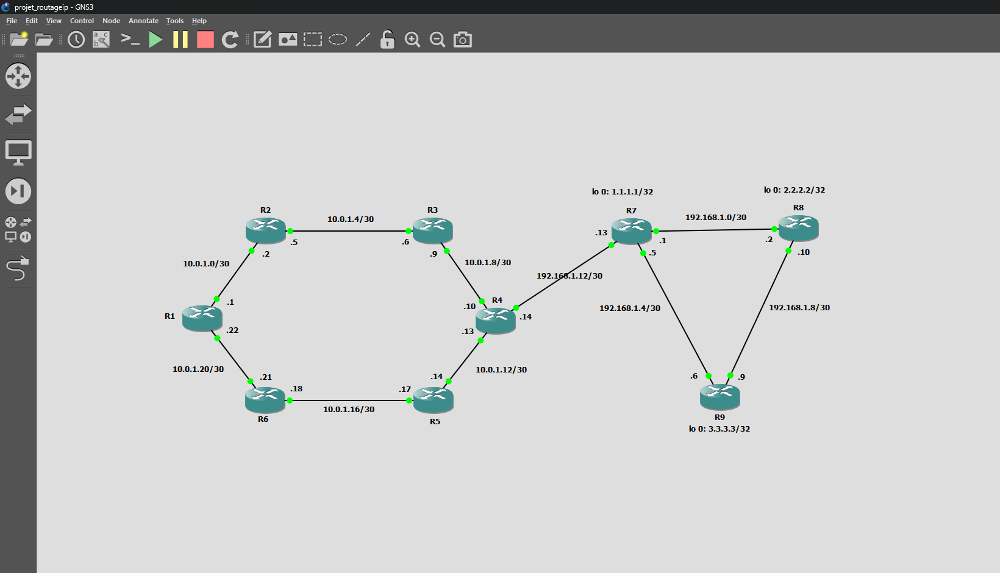
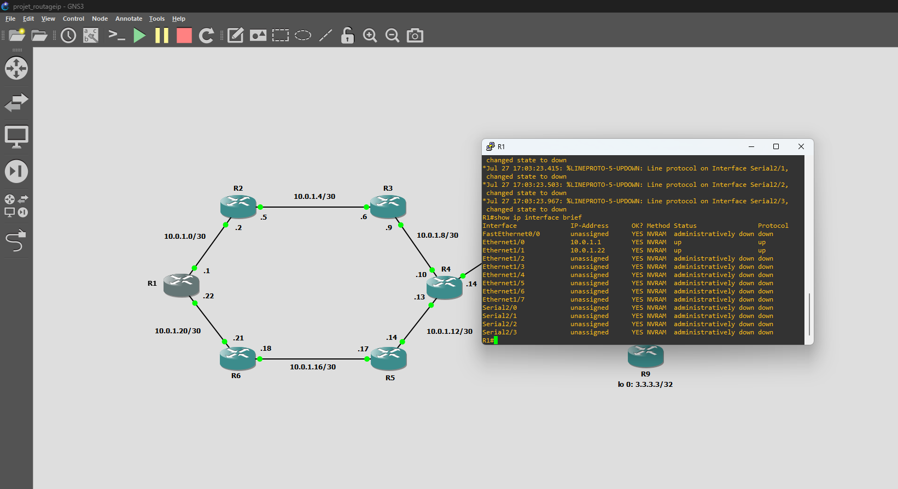
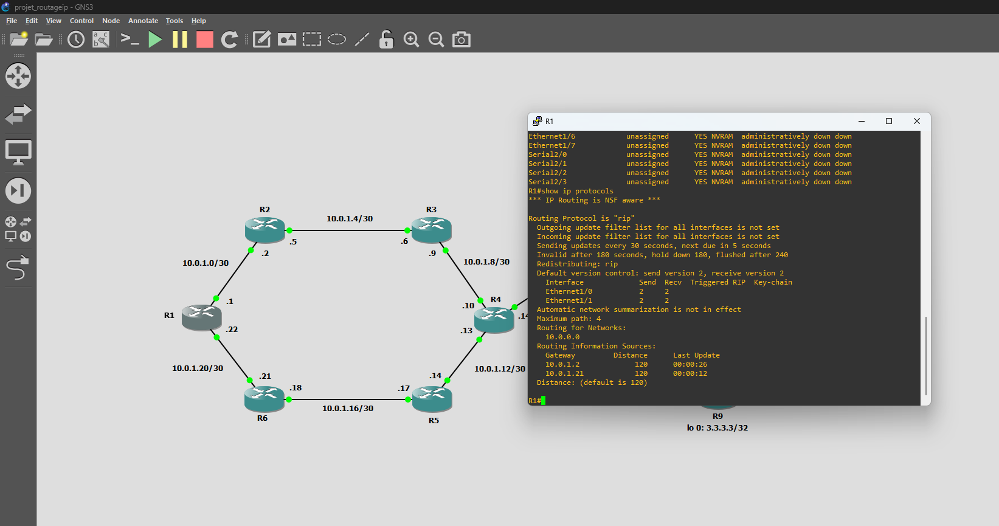
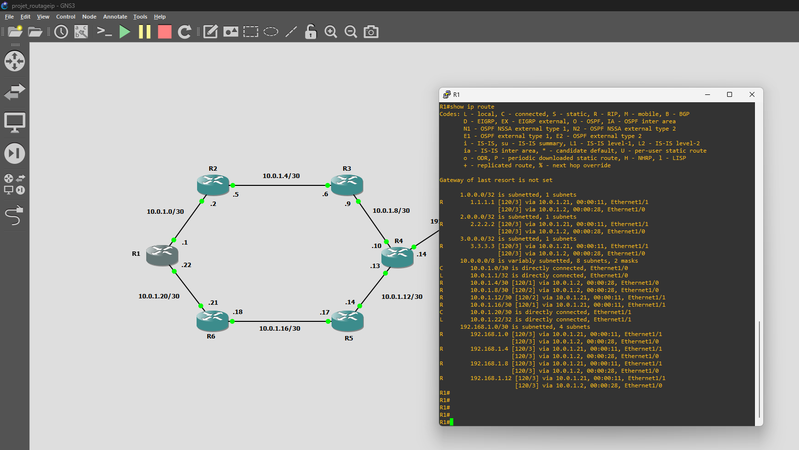
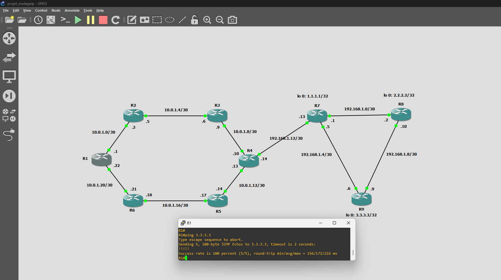
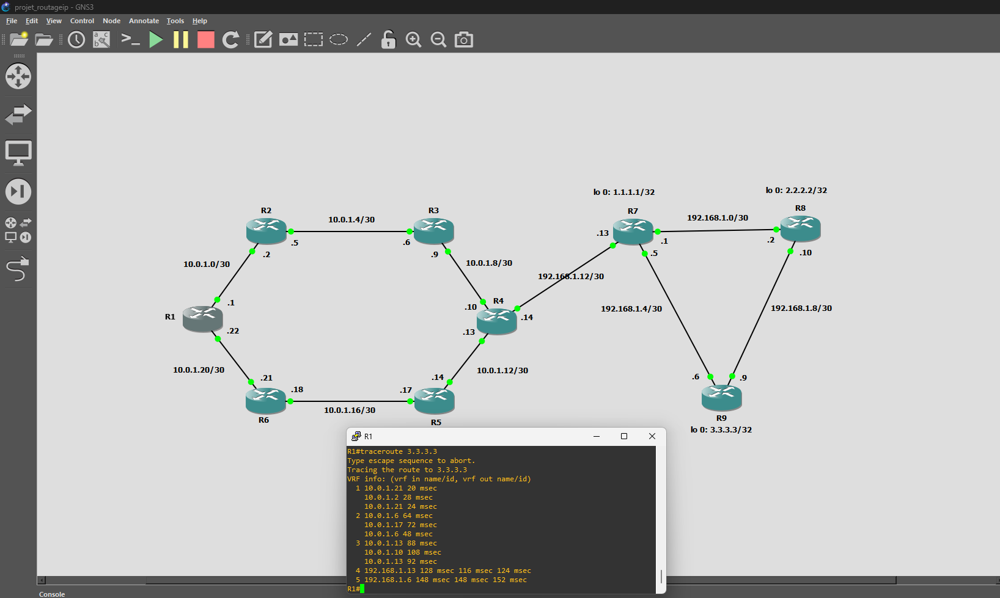

# Projet de Routage IP — Redistribution RIP / OSPF

Topologie réseau conçue et configurée sous GNS3, illustrant la redistribution mutuelle entre les protocoles de routage RIP et OSPF.

## 🎯 Objectif

Simuler un réseau composé de deux domaines de routage distincts (RIP et OSPF), interconnectés par un routeur frontière assurant la redistribution mutuelle des routes entre les deux protocoles.

## 🗺️ Topologie



- **Domaine RIP** : R1, R2, R3, R4, R5, R6 (topologie en hexagone, réseaux `10.0.1.0/30` à `10.0.1.20/30`)
- **Domaine OSPF** : R4, R7, R8, R9 (topologie en triangle, réseaux `192.168.1.0/30` et loopbacks `1.1.1.1`, `2.2.2.2`, `3.3.3.3`)
- **Routeur frontière** : **R4**, seul point de jonction entre les deux domaines, assurant la redistribution `RIP ↔ OSPF`

## ⚙️ Configuration des interfaces



Vérification de l'adressage IP et de l'état des interfaces sur R1 — toutes les interfaces utilisées sont actives (`up/up`).

## 📡 Configuration RIP



Sur R1, `show ip protocols` confirme la configuration RIP version 2, avec redistribution activée (`Redistributing: rip`) et les réseaux `10.0.0.0` annoncés dans le domaine.

## 🧭 Table de routage (point de vue RIP)



La table de routage de R1 montre non seulement les routes RIP internes (`10.0.1.x`), mais aussi les routes **redistribuées depuis le domaine OSPF** : les loopbacks `1.1.1.1`, `2.2.2.2`, `3.3.3.3` ainsi que les réseaux `192.168.1.x` apparaissent en `R`, preuve que la redistribution OSPF → RIP fonctionne correctement à travers R4.

## ✅ Test de connectivité bout-à-bout



Ping réussi (100% de succès) depuis R1 (domaine RIP) vers le loopback `3.3.3.3` de R9 (domaine OSPF), confirmant que les deux domaines communiquent correctement malgré leurs protocoles de routage différents.



Le traceroute confirme le chemin emprunté par les paquets : R1 → R2 → R4 (redistribution) → R7 → R9, traversant bien le routeur frontière R4 pour passer d'un domaine à l'autre.

## 🛠️ Technologies utilisées

- **GNS3** — simulation de la topologie réseau
- **Cisco IOS** — configuration des routeurs
- **RIP v2** — protocole de routage à vecteur de distance
- **OSPF** — protocole de routage à état de liens
- **Redistribution de routes** — interconnexion des deux domaines

## 💡 Ce que j'ai appris

Ce projet m'a permis de comprendre concrètement pourquoi la redistribution de routes est nécessaire dans un réseau hétérogène : en pratique, une entreprise qui fusionne avec une autre, ou qui migre progressivement d'un protocole vers un autre, se retrouve souvent avec plusieurs domaines de routage à faire cohabiter.

J'ai particulièrement travaillé sur la configuration de R4 comme unique point de redistribution, ce qui demande de bien comprendre les différences de métriques entre RIP (distance vectorielle, max 15 sauts) et OSPF (coût basé sur la bande passante) — un point de vigilance important pour éviter les boucles de routage lors de la redistribution.

La vérification via `show ip route` des deux côtés du réseau m'a aussi appris l'importance de valider une configuration non seulement localement, mais bout-à-bout : voir une route redistribuée apparaître jusqu'au routeur le plus éloigné est la vraie preuve qu'une configuration fonctionne, pas seulement sur le routeur où on l'a tapée.

## 📂 Structure du repository

```
projet-routage-ip-rip-ospf/
├── 01-topologie.png
├── 02-interface-brief-r1.png
├── 03-protocols-rip-r1.png
├── 04-route-r1.png
├── 05-ping-r1-r9.png
├── 06-traceroute-r1-r9.png
└── README.md
```
